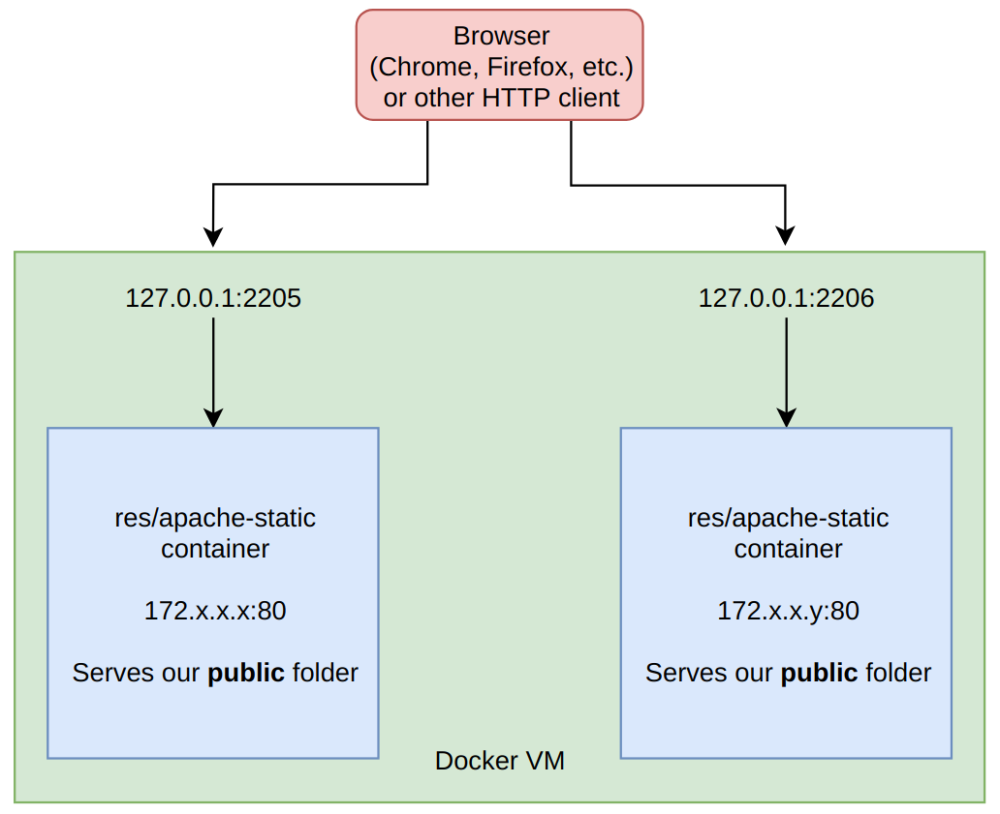

# Step 1: Static Apache httpd server

## General architecture

- Uses Apache's `httpd` web server to serve static content through port 80.
- The `Dockerfile` simply extends the base image and copies our website's sources to the `/var/www/html/` folder.
- It uses the `php:7.3-apache` docker image, as I'm more familiar with that directory structure and we might have a use for PHP in a future step.
- The folder `public` contains the website's sources.

<!--  -->

## The landing page website

- The website served by our image is a simple landing page, with some jokes in it.
- It uses the [Grayscale](https://startbootstrap.com/previews/grayscale/) free bootstrap theme.

## How to use

- In the folder where our `Dockerfile` is located, run `docker build -t res/apache-static .`
- Then, `docker run -d -p 2205:80 res/apache-static` (We use 2205 in this example. You can use your preferred port for this.)
- And we can see that the sources in the `public` folder are served by the server at address `127.0.0.1:2205` in a browser, or any HTTP client.
- Pay attention to the rights on the folder containing the sources. The apache server must be able to read its content.