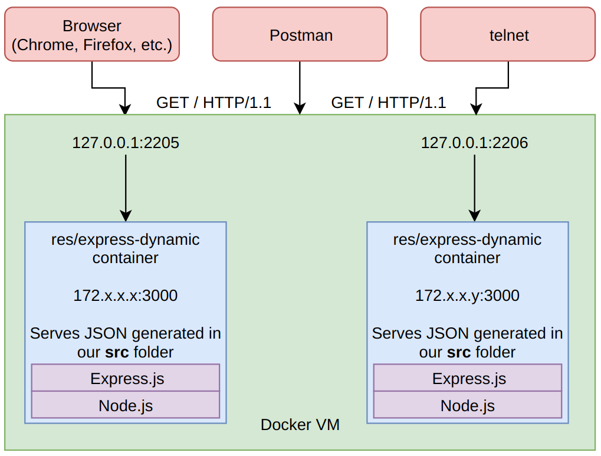

# Step 2: Dynamic express.js server

## General architecture

- Uses Node.js and the Express.js framework to serve dynamic content through port 3000.
- The `Dockerfile` simply extends the `node` base image (version 10.15) and copies our sources (and dependencies) to `/opt/app`.
- The folder `src` contains the sources and the dependencies for the service.
  - `joke.js` simply exports a function to get an array of messages generated using the `loader-message` npm module.
  - `app.js` uses the aforementioned function and uses Express.js to serve the array as JSON to HTTP clients.



## The dynamic content

- Our server generates simple loading screen messages through the [loader-message npm module](https://www.npmjs.com/package/loader-message).
- It creates an array with a random number (between 1 and 10) of messages, adds a timestamp to their generation and sends it as JSON to any client that connects to it.

## How to use

- In the folder `src` where the `package.json` file is located, run `npm install` to install dependencies (`Express.js` and `loader-message`).
- Then, in the folder where our `Dockerfile` is located, run `docker build -t res/express-dynamic .`
- Then, `docker run -d -p 2205:3000 res/express-dynamic` (We use 2205 in this example. You can use your preferred port for this.)
- You can at this point create a request through any HTTP client (your preferred browser, Postman, `telnet` or whatever) to `127.0.0.1:2205` and observe the response.
- Example with telnet (don't forget to hit "return" twice):

```bash
telnet 127.0.0.1 2205
GET / HTTP/1.1

---> response
```