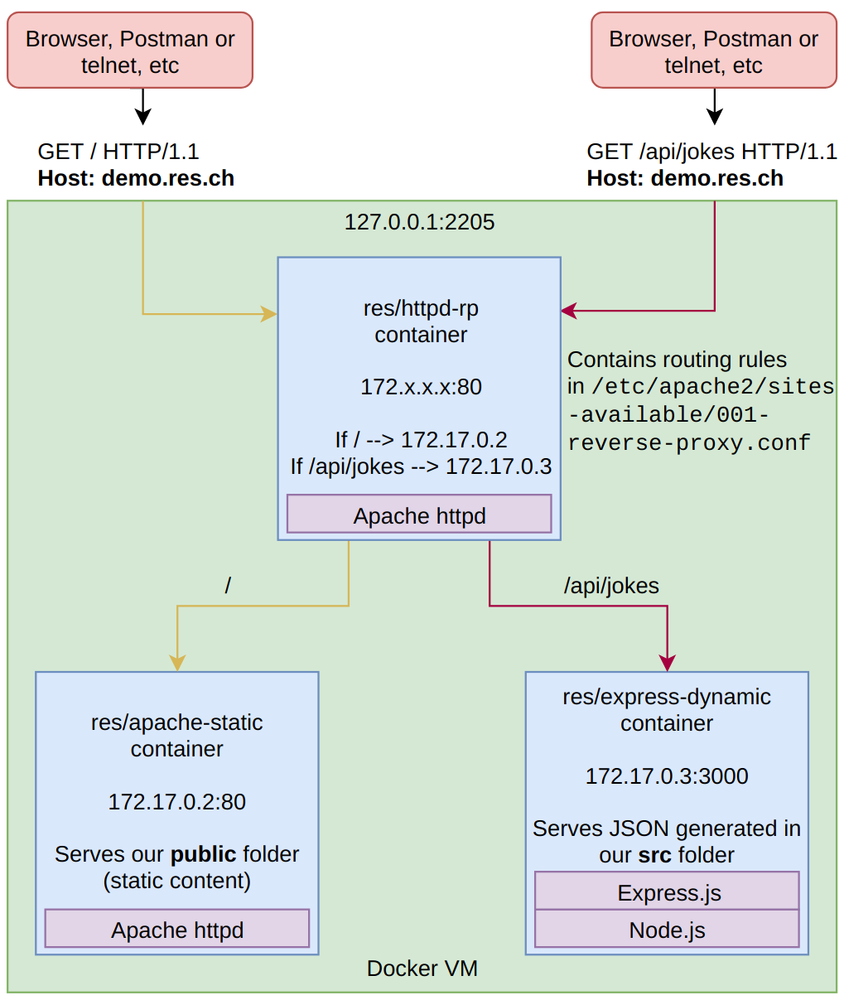

# Step 3: Reverse proxy with Apache httpd

## General architecture

- Uses Apache's `httpd` as a reverse proxy to forward requests to 2 servers.
- Listening on port 80.
- The first server is the one from step 1 (static apache served website).
- The second server is the one from step 2 (dynamic Express.js web service sending JSON).
- The `Dockerfile` simply extends the base image and copies the reverse proxy configuration to `/etc/apache2`.
- It uses the `php:7.3-apache` docker image, as I'm more familiar with that directory structure and we might have a use for PHP in a future step.

## The Configuration

- We create a new VirtualHost in `/etc/apache2/sites-available/` that we call `001-reverse-proxy.conf`.
- We give it a `ServerName`, so that it is accessible only when the header `Host: demo.res.ch` is specified.
- This site doesn't serve resources but forwards the requests to one of the servers specified in `ProxyPass` and `ProxyPassReverse`.
- Make sure the **hardcoded** IP addresses are correct for your setup, and change them accordingly.
- We also added a default VHost (`000-default.conf`) that doesn't do anything to make sure our reverse proxy VHost is not the default one.
  - This is not mandatory, but allows us to see the use of the `Host` header.
  - If you don't want to modify your `/etc/hosts` file, you can `a2dissite 000*`.

## How to use

- Run static site and dynamic content without port mapping:
  - `docker run -d --name apache-static res/apache-static`
  - `docker run -d --name express-dynamic res/express-dynamic`
- Use `docker inspect <container_name> | grep -i ipaddress` to find out the two servers' IP addresses.

- In the folder where our `Dockerfile` is located, run `docker build -t res/httpd-rp .`
- Then, `docker run -d -p 2205:80 res/httpd-rp` (We use 2205 in this example. You can use your preferred port for this.)
- If we run the container now, we'll see that it doesn't work. This is because we must specify the `Host` header to be the `ServerName` in our VirtualHost setup.
  - We can do this manually in `telnet` or Postman, or we can tell our browser to do it using our `hosts` file.
  - If you want to go this way, just add a line in your `hosts` file with `127.0.0.1 demo.res.ch` or whatever ServerName you specified.

- Now we can access `http://demo.res.ch:2205` or `http://demo.res.ch:2205/api/jokes/` through our favourite HTTP client, and get what we expect.

## Disclaimer

Warning: this is a static, hardcoded configuration that might need to be changed each time it is run depending on the IP addresses of the servers. It is not a good idea to use this simple configuration.
